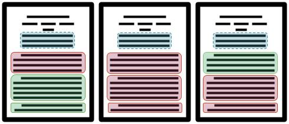

# ragXiv: Retrieval-Augmented Genearation with arXiv knowledge base

Retrieval-Augmented Genearation (RAG) system that leverages the vast repository of academic papers on [arXiv](https://arxiv.org) as its  primary knowledge base.

## Overview

**ragXiv** is a Retrieval-Augmented Generation (RAG) system designed to facilitate **information extraction and expert-level communication on academic quantitative finance topics**. Leveraging the vast repository of academic papers on arXiv, ragXiv aims to streamline the process of retrieving and synthesizing relevant information from scholarly literature, **making complex quantitative finance topics more accessible**.


### Problem Statement

The exponential growth of academic literature poses a significant challenge for researchers and professionals in staying up-to-date with the latest developments. Particularly in the field of quantitative finance, where the depth and complexity of the subject matter can be overwhelming, finding and extracting relevant information from numerous academic papers is time-consuming and cumbersome.

Traditional search engines and databases provide basic keyword-based search functionalities but often fall short in delivering precise and contextually relevant information. Furthermore, the sheer volume of papers makes manual extraction and comprehension of the material inefficient, especially when users require concise explanations of intricate topics.

ragXiv addresses these challenges by implementing a sophisticated **two-step semantic search and retrieval system** that draws upon the extensive arXiv database for quantitative finance. By combining advanced natural language processing techniques with vector-based search capabilities, ragXiv effectively narrows down the vast pool of academic papers to those most pertinent to the user's query and delivers expert-level explanations derived from these sources.

### Key features

1. **Semantic Search in Two Steps**:

    - **Abstract-Level Search**: The system first performs a semantic search between the user’s query and the abstracts of academic papers. This step narrows down the relevant documents, focusing on the most contextually aligned abstracts.
    - **Body-Level Search**: After identifying the most relevant abstracts, ragXiv conducts a second semantic search, this time between the user's query and the body content of the selected papers. This ensures that the most pertinent sections of the papers are considered.

        

2. **Contextual Information Extraction**:

    - Once the relevant abstracts and paper sections are identified, ragXiv builds a context that includes these elements, ensuring the system's responses are based on accurate and contextually relevant information.

3. **Expert-Level Summarization**:

    - The extracted information is used to prompt a Language Model (LLM) to generate clear, concise, and expert-level answers to user queries. The LLM is instructed to rely solely on the provided context, ensuring responses are grounded in the academic literature.

4. **Database-Backed Retrieval**:

    - ragXiv uses a Postgres database with `pg_vector` to store and retrieve vector embeddings of abstracts and paper sections, enabling efficient and scalable search operations.

### Impact

ragXiv empowers researchers, students, and professionals in the field of quantitative finance by providing a tool that not only retrieves relevant academic papers but also distills complex information into understandable explanations. This system reduces the time and effort needed to sift through large volumes of literature, enabling users to focus on advancing their research or understanding of the field.

### Future Directions

While this proof-of-concept version of ragXiv is limited to HTML-formatted papers, future iterations will aim to extend support to PDF documents, incorporate broader academic fields, and enhance the LLM's ability to communicate even more nuanced and complex topics.


## Setup

### Setting up `.env` file

Create a file named .env in the root of your project directory and add the following environment variables:

- `POSTGRES_USER`: `postgres` . _Default PostgreSQL user._
- `POSTGRES_PWD`: `password` . _Change this to a secure password of your choice._
- `POSTGRES_DB`: `ragxiv_db` . _The name of the PostgreSQL database._
- `POSTGRES_HOST`: `postgres_db` . _Since we're using Docker Compose, this should be set to the name of the PostgreSQL service defined in your `docker-compose.yml`_
- `POSTGRES_PORT`: `5432` . _The port PostgreSQL listens on (default)._
- `GROQ_API_KEY`: _Obtain a **free API key** from [GROQ Console](https://console.groq.com/). Register for an account, and follow the instructions to generate your API key. Once you have it, paste it here._

### Using `docker-compose`

To set up the project, run the following command:

```
docker-compose up --build
```

This process typically takes around 10 minutes and performs the following steps:

- **Starts the PostgreSQL database**: Includes the pg_vector extension.
- **Initializes the database**: Creates necessary tables and indices (check `init_db.py`).
- **Fetches documents from arXiv**: Retrieves and stores document embeddings in the database.
- **Runs the Streamlit UI**: Launches the Streamlit application

Once the setup is complete, you can access the Streamlit UI at: `http://localhost:8501`

Once the project has been built, you can start the services using:
```
docker-compose up
```
This command will start the containers, ensure the necessary tables are available, and refresh the data according to `config.yaml` settings. If `max_documents_arxiv` is set to zero, the data will not be updated. Once the refresh is complete, the UI will be accessible.

A manual database update can be triggered by executing script `update_database.py` inside the running docker container:
```bash
docker-compose exec app python update_database.py
```

#### Additional notes

- Make sure [Docker](https://www.docker.com/) and [Docker Compose](https://docs.docker.com/compose/install/) are installed on your system before running the above command.
- Ensure that your `.env` file is configured correctly with all necessary variables.

### Local

Follow these steps to set up and run ragXiv locally without using Docker Compose.

- Prepare `.env` file as described above, including all necessary environment variables.
- Create and Activate a python virtual environment:
```bash
python -m venv ragxiv
```
- Activate the virtual environment
    - On Windows:
    ```
    ragxiv\Scripts\activate
    ```
    - On macOS/Linux
    ```
    source ragxiv/bin/activate
    ```
- With the virtual environment activated, install the required Python packages:
```
pip install -r requirements.txt
```
- Start a PostgreSQL container with the `pg_vector` extension using the following command:
```bash
docker run -d \
    --name postgres \
    -e POSTGRES_PASSWORD=your_password \  # Use the same password as in the .env file
    -v /your/local/volume:/var/lib/postgresql/data \
    -p 5432:5432 \
    ankane/pgvector
```
Make sure the container is running before proceeding to the next steps.
- Run the `init_db.py` script to initialize the database:
```bash
python init_db.py
```
This script will create the necessary tables and indices in the PostgreSQL database.
- Populate the database with documents by running the `update_database.py` script:
```bash
python update_database.py
```
This script reads the configuration file `config.yaml`, fetches documents from arXiv, processes them, and stores their embeddings in the PostgreSQL database.
- Finally, launch the Streamlit UI to interact with ragXiv:
```bash
streamlit run scripts/example_streamlit_app.py
```
Once the Streamlit server is up, you can access the UI in your browser at `http://localhost:8501`.

## Project evaluation
ragXiv is my final project for the 2024 edition of the [LLM Zoomcamp](https://github.com/DataTalksClub/llm-zoomcamp/).
This [report](https://github.com/GMestreM/ragxiv/blob/main/reports/llm_zoomcamp_final_project_report.md#evaluation-criteria) describes how the project addresses each [evaluation criteria point](https://github.com/DataTalksClub/llm-zoomcamp/blob/main/project.md#evaluation-criteria) for the [2024 edition of LLM Zoomcamp](https://github.com/DataTalksClub/llm-zoomcamp/)
